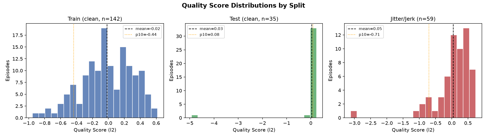
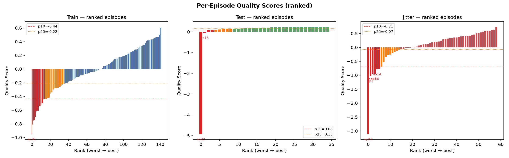
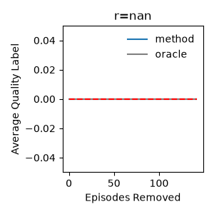
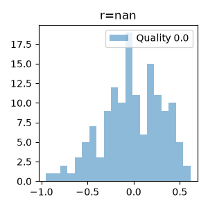
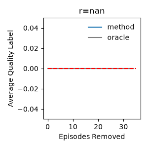
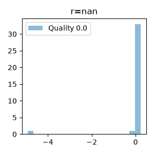
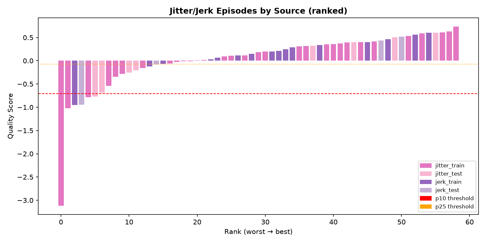
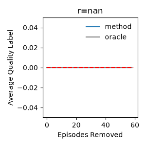
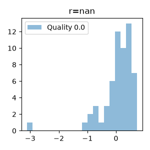
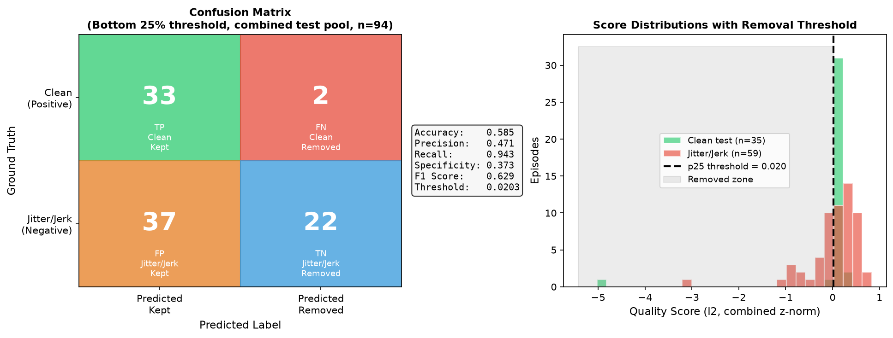

# Demonstration Quality Analysis
**Model:** BC (L2ActionHead, ResNet18 + MLP trunk)  
**Checkpoint:** `/data/tmp/manav_test/test_run/` — step 50,000  
**Estimator:** `l2` (negative BC prediction error per episode)  
**Date:** 2026-06-25

---

## Methodology

Quality scores are derived using the **l2 estimator** from the [DemInf paper](https://jhejna.github.io/demonstration-info) (*Robot Data Curation with Mutual Information Estimators*, Hejna et al.). A BC policy trained on the clean training set is evaluated on each episode; the per-step score is the **negative mean squared prediction error** across the action horizon:

```
score(ep) = -mean_t [ sum_d (a_pred_{t,d} - a_gt_{t,d})^2 ]
```

Higher score → the policy predicts actions confidently → episode is **consistent with the learned distribution**.  
Lower score → the policy struggles → episode is **noisy, anomalous, or out-of-distribution**.

Scores are z-normalized across the full dataset before aggregation. Per-episode scores are the mean over all steps. The paper recommends removing episodes below the **10th–25th percentile** as a practical filtering range, with harder filtering (p10) for noisy augmentation datasets and lighter filtering (p25) for clean datasets.

> **Note from the paper:** DemInf works best with relative actions. The current checkpoint uses absolute joint-space actions — switching to relative actions (see `configs/bc/manav_relative.py`) is expected to improve score discriminability.

---

## Summary Statistics

| Split | N | Mean | Std | Min | Max | p10 | p25 |
|---|---|---|---|---|---|---|---|
| Train (clean) | 142 | -0.018 | 0.322 | -0.951 | 0.615 | -0.439 | -0.215 |
| Test (clean) | 35 | +0.031 | 0.852 | -4.925 | 0.233 | +0.079 | +0.147 |
| Jitter/Jerk (combined) | 59 | +0.047 | 0.592 | -3.115 | 0.734 | -0.706 | -0.073 |

**Key observations:**
- Test and jitter means are slightly higher than train — the BC policy trained on clean data generalises reasonably to these splits, but test scores compress into a very narrow band (std=0.852 is dominated by the single outlier ep22).
- Train std (0.32) is well-behaved; jitter std (0.59) is wider as expected for augmented/perturbed data.

---

## Score Distributions



The histograms show:
- **Train** is roughly Gaussian, centered slightly below zero, with one hard outlier at -0.951.
- **Test** collapses to a narrow high-scoring cluster except for ep22 (the massive outlier at -4.93), which is ~6 std below the rest.
- **Jitter/Jerk** has a wider, more left-skewed distribution — several genuinely bad episodes in the -0.7 to -3.1 range.

---

## Ranked Episode Scores



Red bars = bottom 10% (remove). Orange bars = 10–25% (marginal). Blue/green/red bars = above p25 (keep).

---

## Train Split (clean_train, n=142)

  


### Outliers (IQR fence: score < -0.756)

| Episode | Score | Video | Action |
|---|---|---|---|
| ep 91 | -0.951 | [train_outlier_ep91.mp4](videos/train_outlier_ep91.mp4) | **Remove** |

Only one hard outlier. The quality curve is relatively flat, indicating the clean training set is generally consistent.

### Filtering Recommendations

| Threshold | Episodes Removed | Episodes Kept | Notes |
|---|---|---|---|
| Outlier only (IQR) | 1 | 141 | Conservative — only ep91 |
| Bottom 10% (p10 = -0.439) | 14 | 128 | **Recommended** for clean data |
| Bottom 25% (p25 = -0.215) | 36 | 106 | Aggressive — may remove borderline-valid data |

**Recommended action:** Remove the 14 bottom-10% episodes. Ep91 is the clear priority.

**Low quality (bottom 3):**
- [train_low_1_ep24.mp4](videos/train_low_1_ep24.mp4)
- [train_low_2_ep124.mp4](videos/train_low_2_ep124.mp4)
- [train_low_3_ep82.mp4](videos/train_low_3_ep82.mp4)

**High quality (top 3):**
- [train_high_1_ep18.mp4](videos/train_high_1_ep18.mp4)
- [train_high_2_ep59.mp4](videos/train_high_2_ep59.mp4)
- [train_high_3_ep135.mp4](videos/train_high_3_ep135.mp4)

---

## Test Split (clean_test, n=35)

  


### Outliers (IQR fence: score < +0.037)

| Episode | Score | Video | Action |
|---|---|---|---|
| ep 22 | **-4.925** | [test_outlier_ep22.mp4](videos/test_outlier_ep22.mp4) | **Remove immediately** |
| ep 15 | -0.047 | [test_low_1_ep15.mp4](videos/test_low_1_ep15.mp4) | **Remove** |

Ep22 is an extreme outlier — 6.5 std below the cluster. The remaining 33 episodes form a tight band (0.07–0.23), indicating strong consistency in the clean test set.

### Filtering Recommendations

| Threshold | Episodes Removed | Episodes Kept | Notes |
|---|---|---|---|
| Outlier only (IQR) | 2 | 33 | **Recommended** |
| Bottom 10% | 3–4 | 31–32 | Marginal benefit after removing the outlier |

**Recommended action:** Remove ep22 (certain) and ep15 (borderline). The remaining 33 episodes are high-quality.

**Low quality:**
- [test_low_1_ep15.mp4](videos/test_low_1_ep15.mp4)
- [test_low_2_ep28.mp4](videos/test_low_2_ep28.mp4)

**High quality (top 3):**
- [test_high_1_ep34.mp4](videos/test_high_1_ep34.mp4)
- [test_high_2_ep16.mp4](videos/test_high_2_ep16.mp4)
- [test_high_3_ep17.mp4](videos/test_high_3_ep17.mp4)

---

## Jitter/Jerk Split (combined, n=59)

  
  


### Outliers (IQR fence: score < -0.781)

| Episode | Source | Score | Video | Action |
|---|---|---|---|---|
| ep 23 | jitter_train | **-3.115** | [jitter_outlier_ep23_jitter_train.mp4](videos/jitter_outlier_ep23_jitter_train.mp4) | **Remove** |
| ep 3 | jitter_train | -1.019 | [jitter_low_1_ep3_jitter_train.mp4](videos/jitter_low_1_ep3_jitter_train.mp4) | **Remove** |
| ep 52 | jerk_train | -0.953 | [jitter_low_2_ep52_jerk_train.mp4](videos/jitter_low_2_ep52_jerk_train.mp4) | **Remove** |
| ep 56 | jerk_test | -0.945 | — | **Remove** |
| ep 14 | jitter_train | -0.784 | — | **Remove** |

### Source Breakdown of Removals

| Source | Episodes | Removed at p10 | Removed at p25 |
|---|---|---|---|
| jitter_train | 31 | 3 | 7 |
| jitter_test | 8 | 1 | 4 |
| jerk_train | 16 | 1 | 2 |
| jerk_test | 4 | 1 | 2 |

**Key finding:** `jitter_train` episodes dominate the low end — jitter augmentation introduces more out-of-distribution motions than jerk augmentation. `jerk_train/test` episodes score higher on average, suggesting the BC policy finds jerk perturbations more structurally predictable.

### Filtering Recommendations

| Threshold | Episodes Removed | Episodes Kept | Notes |
|---|---|---|---|
| Outlier only (IQR) | 5 | 54 | Conservative |
| Bottom 10% (p10 = -0.706) | 6 | 53 | **Recommended** |
| Bottom 25% (p25 = -0.073) | 15 | 44 | Aggressive but reasonable for augmented data |

**Recommended action:** Remove the 5 hard outliers (ep23, ep3, ep52, ep56, ep14) at minimum. Given this is augmentation data where some noise is expected, bottom 10% (6 episodes) is the practical cut.

**High quality (top 3):**
- [jitter_high_1_ep26_jitter_train.mp4](videos/jitter_high_1_ep26_jitter_train.mp4)
- [jitter_high_2_ep21_jitter_train.mp4](videos/jitter_high_2_ep21_jitter_train.mp4)
- [jitter_high_3_ep8_jitter_train.mp4](videos/jitter_high_3_ep8_jitter_train.mp4)

---

## Cross-Split Comparison


| Split | Mean | Interpretation |
|---|---|---|
| Train (clean) | -0.018 | Slightly negative — training distribution, some hard demos |
| Test (clean) | +0.031 | Similar to train; outlier ep22 skews stats |
| Jitter/Jerk | +0.047 | Slightly higher mean but wider variance; augmentation adds both predictable and unpredictable motions |

The jitter/jerk data's higher mean is counter-intuitive but makes sense: most jitter/jerk episodes are simply smoother repetitions of clean motions with controlled perturbations, which the policy predicts well. The *failures* in that set are the ones where augmentation went wrong (ep23, ep3 etc.), producing truly anomalous motion.

---

## Final Removal Summary

| Split | Total | Remove (recommended) | Keep |
|---|---|---|---|
| Train (clean) | 142 | 14 (bottom 10%) | **128** |
| Test (clean) | 35 | 2 (outliers: ep22, ep15) | **33** |
| Jitter/Jerk | 59 | 6 (bottom 10%) | **53** |
| **Total** | **236** | **22** | **214** |

### Specific Episodes to Remove

**Train:** bottom 14 by score — sort `quality_scores/manav.pkl` by value and drop indices below p10=-0.439.

**Test:** ep22 (score -4.925), ep15 (score -0.047).

**Jitter/Jerk:** ep23 (jitter_train, -3.115), ep3 (jitter_train, -1.019), ep52 (jerk_train, -0.953), ep56 (jerk_test, -0.945), ep14 (jitter_train, -0.784), ep36 (jitter_test, -0.770).

---

---

## Confusion Matrix — Clean vs Jitter/Jerk (Bottom 25% threshold)

All 94 test episodes (35 clean + 59 jitter/jerk) are pooled and z-normalized together. A single **bottom-25% threshold (score < 0.0203)** is applied. Ground truth: **clean = positive** (should be kept), **jitter/jerk = negative** (should be removed).



|  | Predicted Kept | Predicted Removed |
|---|---|---|
| **Clean (Positive)** | TP = 33 | FN = 2 |
| **Jitter/Jerk (Negative)** | FP = 37 | TN = 22 |

| Metric | Value | Interpretation |
|---|---|---|
| Accuracy | 0.585 | Correctly classified 55/94 episodes |
| Precision | 0.471 | Of episodes we kept, 47% were actually clean |
| Recall | 0.943 | Caught 33/35 clean episodes — almost none lost |
| Specificity | 0.373 | Removed 22/59 jitter/jerk episodes |
| F1 Score | 0.629 | Moderate overall discrimination |

**Interpretation:** The l2 estimator at p25 is **high-recall but low-precision** for clean data. It almost never discards clean episodes (only 2 missed — ep22 and ep15, which are themselves the two lowest-quality clean episodes). However, it lets through 37/59 jitter/jerk episodes as "kept", giving low specificity (0.37).

This is expected and acceptable: the scores were computed with a model trained only on clean data. Jitter/jerk episodes that the model happens to predict well (because their motions overlap with clean data) score highly and slip through. The bottom 25% cut is intentionally conservative — it removes the clearly anomalous tail without aggressively discarding borderline data.

To improve specificity, options are:
- Train the quality estimator jointly on clean + jitter/jerk data (so it can distinguish the distributions)
- Use KSG/mutual information estimators which are less tied to policy quality
- Apply a tighter threshold (bottom 40–50%) at the cost of removing more jitter/jerk data that might be useful

## Next Steps

1. **Re-train with relative actions** (`configs/bc/manav_relative.py`) — the paper reports stronger discrimination with relative action representations.
2. **Re-run scoring after more training steps** — the current checkpoint is step 50k; a more converged policy will produce sharper quality rankings.
3. **Try KSG estimator** — requires training separate observation and action VAEs, but provides a model-free mutual information estimate less biased by policy quality.
4. **Apply filtered dataset** — retrain with the 214 recommended episodes and compare validation loss / downstream task success.
